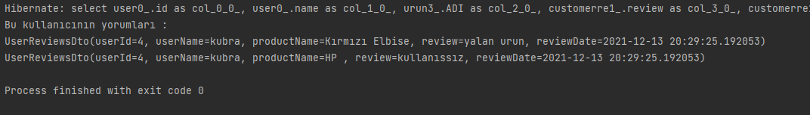
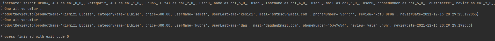
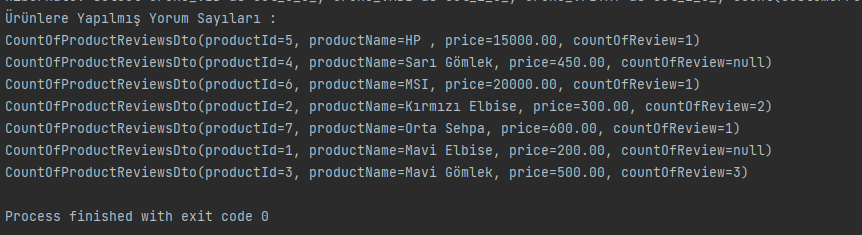

# Ödev 1 

## İçerikler
* [Ekran Görüntüleri](#ekran-görüntüleri)
* [Kullanım](#kullanım)
* [Proje Durumu](#proje-durumu)

## Ekran Görüntüleri

<!-- If you have screenshots you'd like to share, include them here. -->

## Kullanım
How does one go about using it?
Provide various use cases and code examples here.

`Öncelikle n11_bootcamp adında bir veritabanı oluşturulmalı ve hibernatecfg.xml deki konfigürasyonlar özelleştirilmelidir.`

`Projeyi klonladıktan sonra tabloları oluşturması amacıyla herhangi bir application'da 1 kere çalıştırmalıdır.`

`Daha sonra hibernatecfg.xml üzerinde "<property name="hibernate.hbm2ddl.auto">create</property>" create kısmı update olarak değiştirilmelidir.`

`Veritabanına ise gerekli dataları setlemek için all_data_instert.sql 'deki datalar veritabanındaki query tool üzerinde çalıştırılmalıdır.`

`Daha sonra Intelij Idea üzerinde applicationlar çalıştırılabilir. `

## Proje Durumu
Project is: _complete_

